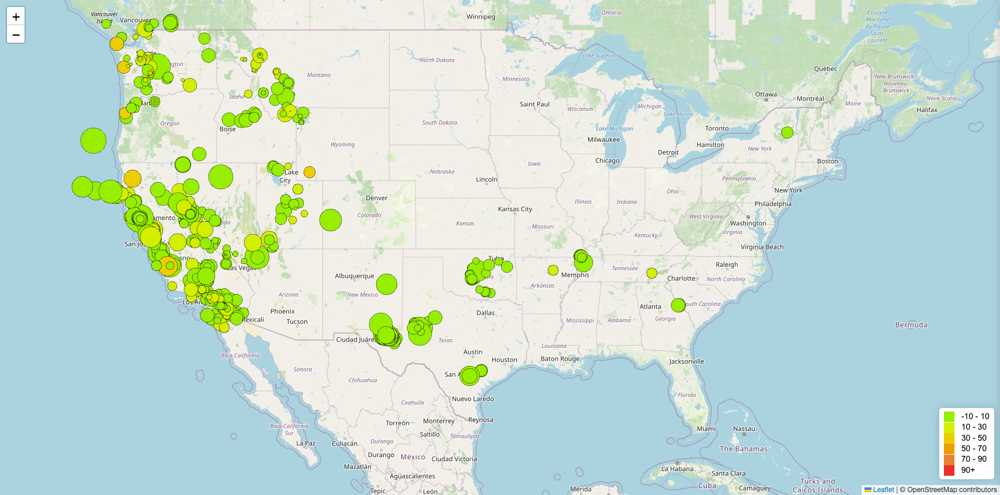
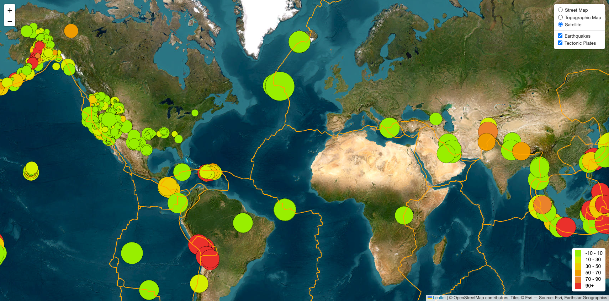

# Leaflet Earthquake Visualization

This project visualizes earthquake and tectonic plate data on an interactive map using [Leaflet.js](https://leafletjs.com/). You'll see earthquake locations, magnitudes, and depths updated in near real-time, with the option to toggle tectonic plates and map styles.

## 🌍 Live Features

- Earthquake data updated weekly from the [USGS GeoJSON Feed](https://earthquake.usgs.gov/earthquakes/feed/v1.0/geojson.php)
- Earthquake markers sized by magnitude and colored by depth
- Toggleable tectonic plate boundaries from the [Fraxen GitHub dataset](https://github.com/fraxen/tectonicplates)
- Multiple base map styles: Street Map, Topographic Map, and Satellite
- Popups with location and magnitude
- Legend showing depth color scale

---

## 📑 Table of Contents

- [Live Demo Links](#-live-demo-links)
- [How It Works](#how-it-works)
- [Screenshots](#screenshots)
- [Folder Structure](#folder-structure)
- [Data Sources](#data-sources)
- [Credits](#credits)

---

## 🚀 Live Demo Links

- [Part 1 - Earthquake Visualization](https://joeportnoy.github.io/leaflet-challenge/Leaflet-Part-1/)
- [Part 2 - Earthquakes + Tectonic Plates](https://joeportnoy.github.io/leaflet-challenge/Leaflet-Part-2/)

---

## ⚙️ How It Works

- **Leaflet.js** is used to render the map
- **D3.js** is used to fetch GeoJSON data
- Markers are generated based on earthquake magnitude and depth
- Tectonic plate boundaries are overlaid in orange
- A legend helps explain the depth colors

---

## 🖼 Screenshots

| Earthquake Map View | Tectonic Plates Overlay |
|---------------------|-------------------------|
|  |  |

---

## 📁 Folder Structure

```
leaflet-challenge/
├── images/
│   └── part-1.png
│   └── part-2.png
├── Leaflet-Part-1/
│   ├── index.html
│   └── static/
│       ├── css/
│       │   └── style.css
│       └── js/
│           └── logic.js
├── Leaflet-Part-2/
│   ├── index.html
│   └── static/
│       ├── css/
│       │   └── style.css
│       └── js/
│           └── logic.js
└── README.md
```

---

## 🌐 Data Sources

- [USGS Earthquake Data (GeoJSON)](https://earthquake.usgs.gov/earthquakes/feed/v1.0/geojson.php)
- [Tectonic Plate Boundaries](https://github.com/fraxen/tectonicplates)

---

## 🙌 Credits

- Earthquake data by the U.S. Geological Survey (USGS)
- Plate boundary data by Fraxen on GitHub
- Mapping by [Leaflet.js](https://leafletjs.com/)
- Data requests using [D3.js](https://d3js.org/)